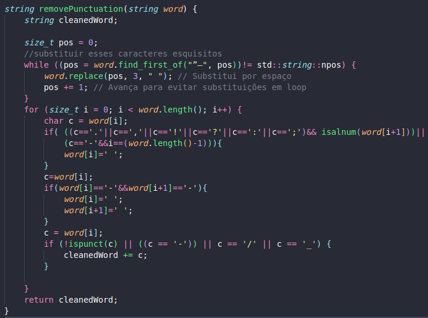
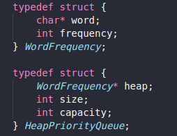

# TOP K ITEMS:

Um exemplo clássico de problema que pode ser solucionado utilizando hash e heap é o chamado **top k itens**. Neste problema, é necessário encontrar os k itens mais valiosos de uma coleção de dados. Logo, o hash é utilizado para contar a frequência de todos os itens, enquanto o heap é aplicado na manutenção de uma lista dos k itens de maior valor. Com isso em mente, vamos elaborar uma solução em C/C++ para a seguinte entrada:

1. Criar uma tabela de dispersão (hash) para contar a frequência de cada elemento tokenizado da coleção de dados de entrada.
2. Criar uma árvore de prioridades (heap) de tamanho k e inserir os primeiros k elementos do hash nela.
3. Para cada elemento restante na hash:
   - Comparar a contagem com o menor valor do heap.
   - Se a contagem for maior do que o menor valor da heap:
     - Remover o menor valor.
     - Inserir o novo elemento.
     - Refazer a estrutura.
   - Caso contrário, ignorar o elemento e avançar para o próximo.

# ENTRADA:

A entrada consiste de uma sequência de arquivos de texto nomeados de "input.txt" mais um arquivo de stopwords nomeado "stopwords.txt" que apresenta as palavras que devem ser desconsideradas pelo algoritmo na implementação da solução.

Os arquivos de texto do tipo "input.txt" devem seguir um padrão de nomenclatura. Para garantir que a leitura dos arquivos ocorram corretamente.

`Exemplo`: quantidade de entradas(fora stopwords) = 2 - arquivos de entrada serão: "input1.txt" e "input2.txt".

###

# IMPLEMENTAÇÃO DA SOLUÇÃO:

A solução foi implementada em três etapas principais: manipulação dos arquivos de entrada para tratamento das palavras, inserção na hash para contar a frequência que as palavras ocorrem e a obtenção das palavras mais frequentes utilizando uma estrutura de heap.

## Tratamento das palavras

A partir dos arquivos de entrada, cada palavra é lida com a biblioteca `<fstream>` e formatada com as seguintes funções:

- `removePunctuation()`: remove as pontuações das strings lidas.
- `lowerString()`: converte os caracteres da palavra para minúsculo.

Alguns caracteres precisam de tratamentos específicos, mas a estratégia utilizada como solução é substituir sempre os caracteres indesejados por caracteres de espaço.

Além disso, é preciso verificar se as palavras são diferentes da lista de stopwords fornecida na entrada. Para isso, a solução utilizada compara a palavra de entrada da iteração corrente com um set que armazena as stopwords fornecidas. Palavras contidas na lista de stopwords não são inseridas na hash.

## Inserção na hash

Após formatar as palavras, cada uma é inserida em um `unordered_map`.

O `unordered_map` é uma classe da biblioteca padrão do C++ que implementa uma tabela de hash associativa. Essa estrutura faz parte da família de contêineres do C++ e é utilizada para armazenar pares de chave-valor, onde cada chave é única e mapeada para um valor correspondente. No caso do problema, a chave é a própria palavra e o valor associado é a frequência em que a palavra ocorre no texto.

Para tratar colisões, o `unordered_map` usa técnicas como listas encadeadas para armazenar várias entradas que mapeiam para o mesmo índice.

Entretanto, o C++ não especifica qual função hash o `unordered_map` deve usar. A implementação da função hash é deixada para a biblioteca padrão do compilador.

O compilador utilizado (g++ 11.3.0) utiliza a função hash padrão da biblioteca libstdc++. Para tipos de chave string, a função de hash opera com base nos caracteres da string usando uma função hash simples. A implementação exata pode variar entre versões, mas geralmente envolve somar ou combinar os códigos ASCII ou Unicode dos caracteres.

A seguir uma representação de uma tabela hash em que as chaves(no caso nomes) são direcionadas para um endereço do vetor pela função de hash:

Vale ressaltar que uma estrutura de hash é uma ótima escolha para contagem de palavras por ter um custo de acesso constante O(1).<p\>

## Estrutura Heap

Para organizar e obter as palavras mais frequentes armazenadas na estrutura hash, utiliza-se a estrutura de heap mínimo. Em um heap mínimo, o nó raiz sempre conterá o valor mínimo entre todos os elementos no heap. Os nós pais terão valores menores que os valores em seus nós filhos. Essa propriedade possibilita a recuperação eficiente do valor mínimo e seguir uma estrutura "crescente" de valores, do nó raiz aos seus filhos abaixo na estrutura de árvore. Dessa forma, nas folhas da estrutura, estão os elementos mais frequentes. A imagem a seguir exemplifica a configuração de um heap mínimo:
<p\>

O algoritmo implementado segue a seguinte estrutura e funções:<p\>

- `createHeap()`: aloca memória e inicializa a estrutura do heap, com capacidade máxima.
- `insert()`: insere um novo elemento no heap e verifica se deve substituir o elemento na raiz caso tenha maior prioridade e realiza o reequilíbrio da árvore com `adjustHeap()`.
- `adjustHeap()`: mantém a propriedade de min heap ao percorrer a árvore e trocar elementos fora de ordem. Chamado após inserções e remoções.
- `shouldInsert()`: verifica se o elemento a ser inserido tem maior prioridade que o da raiz, para possível substituição.
- `printHeap()`: imprime os elementos em ordem crescente de prioridade.
- `destroyHeap()`: libera a memória alocada.

Vale ressaltar que a utilização de uma estrutura de heap garante uma otimização no custo para solucionar o problema. O problema poderia ser solucionado também utilizando um método de ordenação, por exemplo, mas o custo envolvido seria maior. 

# SAÍDA

### A saída consiste nas TOP K palavras mais frequentes dentre os arquivos de entrada fornecidos.

Testando com as entradas [A semana](dataset/input2.txt) e [Dom Casmurro](input2.txt), a saída apresentada foi: 

# Conclusão

Portanto, de acordo com a proposta apresentada, as estruturas utilizadas permitem uma solução viável para o problema. A contagem de frequência com uma estrutura de hash permite inserir e buscar os dados de forma eficiente. Além disso, utilizando uma estrutura de heap para obtenção dos k elementos também permite uma forma mais eficiente de organizar os dados sem precisar ordenar a estrutura com um método de ordenação propriamente dito. Dessa forma, a implementação visa uma solução do problema que envolve um custo computacional menor.

# Compilação e execução

| Comando          | Função                           |
| -----------------| -------------------------------- |
| `make clean`     | Apaga a última compilação realizada contida na pasta build |
| `make`           | Executa a compilação do programa utilizando o gcc, e o resultado vai para a pasta build |
| `make run`       | Executa o