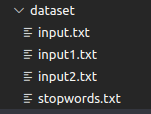
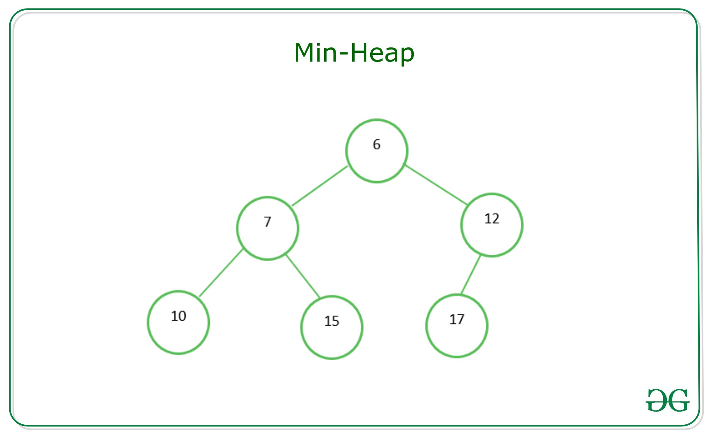
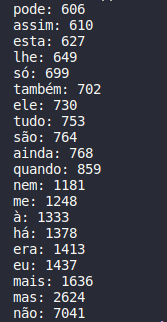

# TOP K ITEMS:

Um exemplo clássico de problema que pode ser solucionado utilizando hash e heap é o chamado **top k itens**. Neste problema, é necessário encontrar os k itens mais valiosos de uma coleção de dados. Logo, o hash é utilizado para contar a frequência de todos os itens, enquanto o heap é aplicado na manutenção de uma lista dos k itens de maior valor. Com isso em mente, vamos elaborar uma solução em C/C++ para a seguinte entrada:

1. Criar uma tabela de dispersão (hash) para contar a frequência de cada elemento tokenizado da coleção de dados de entrada.
2. Criar uma árvore de prioridades (heap) de tamanho k e inserir os primeiros k elementos do hash nela.
3. Para cada elemento restante na hash:
   - Comparar a contagem com o menor valor do heap.
   - Se a contagem for maior do que o menor valor da heap:
     - Remover o menor valor.
     - Inserir o novo elemento.
     - Refazer a estrutura.
   - Caso contrário, ignorar o elemento e avançar para o próximo.

# Entrada:

A entrada consiste de uma sequência de arquivos de texto nomeados de "input.txt" mais um arquivo de stopwords nomeado "stopwords.txt" que apresenta as palavras que devem ser desconsideradas pelo algoritmo na implementação da solução.

Os arquivos de texto do tipo "input.txt" devem seguir um padrão de nomenclatura. Para garantir que a leitura dos arquivos ocorram corretamente.

`Exemplo`: quantidade de entradas(fora stopwords) = 2 - arquivos de entrada serão: "input1.txt" e "input2.txt".

No repositório do projeto encontra-se os dois textos utilizados para testes:
["input1.txt"](dataset/input1.txt) e ["input2.txt"](dataset/input2.txt)




Além disso, é importante destacar que o valor de K é definido como uma constante no próprio código no arquivo de cabeçalho [`load.hpp`](src/load.hpp). Para a execução de testes e apreentação da saída o valor de K utilizado será 20.

# Implementação:

A solução foi implementada em três etapas principais: manipulação dos arquivos de entrada para tratamento das palavras, inserção na hash para contar a frequência que as palavras ocorrem e a obtenção das palavras mais frequentes utilizando uma estrutura de heap.

## Tratamento das palavras

A partir dos arquivos de entrada, cada palavra é lida com a biblioteca `<fstream>` e formatada com as seguintes funções:

- `removePunctuation()`: remove as pontuações das strings lidas.
- `lowerString()`: converte os caracteres da palavra para minúsculo.

Alguns caracteres precisam de tratamentos específicos, mas a estratégia utilizada como solução é substituir sempre os caracteres indesejados por caracteres de espaço,como mostra a função a seguir:

```cpp

string removePunctuation(string word) {
    
    string cleanedWord;
    size_t pos = 0;
     //substituir esses caracteres esquisitos
    while ((pos = word.find_first_of("”—", pos))!= std::string::npos) {
        word.replace(pos, 3, " "); // Substitui por espaço
        pos += 1; // Avança para evitar substituições em loop
    }
    for (size_t i = 0; i < word.length(); i++) {
        char c = word[i];
        if( ((c=='.'||c==','||c=='!'||c=='?'||c==':'||c==';')&& isalnum(word[i+1]))||
            (c=='-'&&i==(word.length()-1))){
            word[i]=' ';
        }
        c=word[i];
        if(word[i]=='-'&&word[i+1]=='-'){
            word[i]=' ';
            word[i+1]=' ';
        }
        c = word[i];
        if (!ispunct(c) || ((c == '-')) || c == '/' || c == '_') {
            cleanedWord += c;
        }
        
    }
    return cleanedWord;
}

```

Além disso, é preciso verificar se as palavras são diferentes da lista de stopwords fornecida na entrada. Para isso, a solução utilizada compara a palavra de entrada da iteração corrente com um set que armazena as stopwords fornecidas. Palavras contidas na lista de stopwords não são inseridas na hash.

O `unordered_set` utilizado para armazenar as stopwords é um contêiner da biblioteca padrão do C++ que funciona como um conjunto não ordenado de elementos. Dessa forma, garante-se que palavras não se repitam dentre a lista de stopwords.

## Inserção na hash

Após formatar as palavras, cada uma é inserida em um `unordered_map`.

O `unordered_map` é uma classe da biblioteca padrão do C++ que implementa uma tabela de hash associativa. Essa estrutura faz parte da família de contêineres do C++ e é utilizada para armazenar pares de chave-valor, onde cada chave é única e mapeada para um valor correspondente. No caso do problema, a chave é a própria palavra e o valor associado é a frequência em que a palavra ocorre no texto.

Para tratar colisões, o `unordered_map` usa técnicas como listas encadeadas para armazenar várias entradas que mapeiam para o mesmo índice.

O hash padrão usado em `std::unordered_map` em C++ é o objeto de função `std::hash<Key>`, onde `Key` é o tipo das chaves no mapa. Esse objeto de função tem especializações padrão para todos os tipos integrados, como int, char, bool, etc., e alguns outros tipos da biblioteca padrão, como std::string e std::thread. Para esses tipos, a função de hash retorna um valor size_t que representa o padrão de bits da chave. Por exemplo, para uma chave int, a função de hash simplesmente retorna a própria chave convertida para size_t.

Para outros tipos que não são integrados nem tipos da biblioteca padrão, como classes ou structs definidos pelo usuário, é necessário especializar `std::hash<Key>` para o seu tipo ou criar seu próprio objeto de função que implementa uma função de hash para esse tipo. Você pode então passar esse objeto de função como um parâmetro de template para `std::unordered_map`.

A chance de colisão, que significa que duas chaves diferentes têm o mesmo valor de hash, depende da implementação da função de hash e do tamanho da tabela de hash. Geralmente, uma boa função de hash deve distribuir uniformemente as chaves pela tabela de hash e evitar aglomerações ou padrões. 

A documentação da STL do C++ não especifica como as funções de hash são implementadas para diferentes tipos, então isso fica a cargo de cada fornecedor de compilador decidir (no caso, o gcc/g++).

Por exemplo, no GCC, a função de hash para `std::string` é definida da seguinte forma:

```cpp
template<>
struct hash<string>
  : public __hash_base<size_t, string>
{
  size_t
  operator()(const string& __s) const noexcept
  { return std::_Hash_impl::hash(__s.data(), __s.length()); }
};
```

Essa função chama uma função auxiliar `std::_Hash_impl::hash`, que é definida da seguinte forma:

```cpp
struct _Hash_impl
{
  static size_t
  hash(const void* __ptr, size_t __clength,
       size_t __seed = static_cast<size_t>(0xc70f6907UL))
  {
    // Semelhante ao hash murmur
    const size_t __m = 0x5bd1e995;
    const int __r = 24;
    size_t __h = __seed ^ __clength;
    const unsigned char* __data = static_cast<const unsigned char*>(__ptr);
    for (; __clength >= sizeof(size_t); __data += sizeof(size_t), __clength -= sizeof(size_t))
      {
        size_t __k = *reinterpret_cast<const size_t*>(__data);
        __k *= __m;
        __k ^= __k >> __r;
        __k *= __m;
        __h *= __m;
        __h ^= __k;
      }
    switch (__clength)
      {
      case 3:
        __h ^= static_cast<size_t>(__data[2]) << 16;
      case 2:
        __h ^= static_cast<size_t>(__data[1]) << 8;
      case 1:
        __h ^= static_cast<size_t>(__data[0]);
        __h *= __m;
      };
    // Faz algumas misturas finais
    __h ^= __h >> 13;
    __h *= __m;
    __h ^= __h >> 15;
    return __h;
  }
};
```

Essa função implementa uma variante do MurmurHash2, que é um algoritmo de hash rápido e bem conhecido, com boas propriedades de resistência a colisões e distribuição. Ela recebe um ponteiro para os dados, seu comprimento e um valor de semente opcional como parâmetros, e retorna um valor size_t como código de hash.

A seguir uma representação de uma tabela hash em que as chaves(no caso nomes) são direcionadas para um endereço do vetor pela função de hash:


<p style="text-align: justify">Vale ressaltar que uma estrutura de hash é uma ótima escolha para contagem de palavras por ter um custo de acesso constante O(1). Utilizar uma estrutura como um vetor convencional afetaria significativamente o custo do algoritmo por ser necessário percorrer todo o vetor para fazer buscas e ajustes nos dados armazenados.<p\>


## Estrutura Heap

<p style="text-align: justify">
Para organizar e obter as palavras mais frequentes armazenadas na estrutura hash, utiliza-se a estrutura de heap mínimo. Em um heap mínimo, o nó raiz sempre conterá o valor mínimo entre todos os elementos no heap. Os nós pais terão valores menores que os valores em seus nós filhos. Essa propriedade possibilita a recuperação eficiente do valor mínimo e seguir uma estrutura "crescente" de valores, do nó raiz aos seus filhos abaixo na estrutura de árvore. Dessa forma, nas folhas da estrutura, estão os elementos mais frequentes. A imagem a seguir exemplifica a configuração de um heap mínimo:
<p\>





<p style="text-align: justify">
O algoritmo implementado segue a seguinte estrutura e funções:<p\>

```cpp
typedef struct {
    char* word;
    int frequency;
} WordFrequency;

```

```cpp
typedef struct {
    WordFrequency* heap;
    int size;
    int capacity;
} Heap;

```


- `createHeap()`: aloca memória e inicializa a estrutura do heap, com capacidade máxima.
- `insert()`: insere um novo elemento no heap e verifica se deve substituir o elemento na raiz caso tenha maior prioridade e realiza o reequilíbrio da árvore com `adjustHeap()`.
- `adjustHeap()`: mantém a propriedade de min heap ao percorrer a árvore e trocar elementos fora de ordem. Chamado após inserções e remoções.
- `shouldInsert()`: verifica se o elemento a ser inserido tem maior prioridade que o da raiz, para possível substituição.
- `printHeap()`: imprime os elementos em ordem crescente de prioridade.
- `destroyHeap()`: libera a memória alocada.


Vale ressaltar que a utilização de uma estrutura de heap garante uma otimização no custo para solucionar o problema. O problema poderia ser solucionado também utilizando um método de ordenação, por exemplo, mas o custo envolvido seria maior, uma vez que o custo médio envolvido para ordenar completamente uma lista seria O(nlogn) e o custo médio envolvido para manipulação da estrutura do heap é O(nlogk) em que k é a quantidade de elementos mais frequentes. Isso acontece devido à propriedade de construção e estruturação de um heap mínimo, como foi citado.   

# Teste e apresentação da saída

A saída consiste nas TOP K palavras mais frequentes dentre os arquivos de entrada fornecidos.

Os testes foram realizados individualmente com dois arquivos de texto disponibilizados juntamente ao problema, entretanto, o teste aqui apresentado consiste na junção dos dois arquivos de texto em um mesmo teste. É importante lembrar que o algoritmo realiza a leitura de vários arquivos desde que todos esses atendam ao padrão de nomenclatura (input1.txt, input2.txt, input3.txt ...).

Testando com as entradas [A semana](dataset/input2.txt) e [Dom Casmurro](input2.txt), para K definido como uma constante de valor 20, os 20 primeiros elementos são apresentados na saída de exemplo. A saída apresentada foi: 



Como o exemplo exibe, cada palavra é acompanhada da sua frequência dentre os arquivos de texto fornecidos como entrada.

Observação: Um arquivo de saída extra é apresentado após a execução. O arquivo `output.txt` é gerado após a execução do algoritmo e apresenta todas as palavras armazenadas no unordered_map. 

# Conclusão e Análise de Custo Computacional

Portanto, de acordo com a proposta apresentada para encontrar os k elementos mais frequentes, as estruturas utilizadas permitem uma solução viável para o problema. A contagem de frequência com uma estrutura de hash permite inserir e buscar os dados de forma eficiente, considerando que o custo envolvido para buscas nessa estrutura é O(1). Além disso, utilizando uma estrutura de heap para obtenção dos k elementos, também permite uma forma mais eficiente de organizar os dados sem precisar ordenar a estrutura com um método de ordenação propriamente dito. Dessa forma, a implementação visa uma solução do problema que envolve um custo computacional menor (`O(nlogk)`) quando comparado à utilização de vetores associados a métodos de ordenação (`O(nlogn)`).

Ao analisar em conjunto os processos de tratamento das palavras, a inserção na hash e o gerenciamento do heap, é evidente que essa abordagem oferece uma maneira otimizada de identificar as palavras mais frequentes. A combinação dessas etapas proporciona uma solução equilibrada, que alia simplicidade com eficiência, permitindo que a tarefa de encontrar os k elementos mais valiosos seja realizada de maneira rápida e precisa. Dessa maneira, a implementação demonstra um cuidadoso planejamento das estruturas utilizadas, tornando-se uma solução robusta para o problema de seleção dos top k itens.


# Compilação e execução

| Comando          | Função                           |
| -----------------| -------------------------------- |
| `make clean`     | Apaga a última compilação realizada contida na pasta build |
| `make`           | Executa a compilação do programa utilizando o gcc, e o resultado vai para a pasta build |
| `make run`       | Executa ocódigo|


# Especificações

| Componentes            | Detalhes                                                                                         |
| -----------------------| -----------------------------------------------------------------------------------------------  |
|  `Processador`         | Intel© Core™ i7-4500U CPU @ 1.80GHz × 2                                            |
|  `RAM Instalada`       | 8.0 GB (Utilizável: 7.6 GB)                                                                      |
|  `Tipo de Sistema`     | Sistema Operacional de 64 bits, processador baseado em x64                                       |
|  `Sistema Operacional` | Linux Mint 21.1 Cinnamon                                            |
|`Compilador`| GCC - g++ (Ubuntu 11.3.0-1ubuntu1~22.04) 11.3.0  |


# Referências


GeeksforGeeks. Difference between Min Heap and Max Heap. Disponível em: https://www.geeksforgeeks.org/difference-between-min-heap-and-max-heap/.

TechTudo. O que é hash?. Disponível em: https://www.techtudo.com.br/noticias/2012/07/o-que-e-hash.ghtml.

Stack Overflow. What is the default hash function used in C++ std::unordered_map?. Disponível em: https://stackoverflow.com/questions/19411742/what-is-the-default-hash-function-used-in-c-stdunordered-map.

GeeksforGeeks. Binary Heap. Disponível em: https://www.geeksforgeeks.org/binary-heap/.

# Autor

Emanuel Vieira Tavares | Engenharia da Computação ~ CEFET-MG

[](mailto:emanuelvtcefet@gmail.com)
